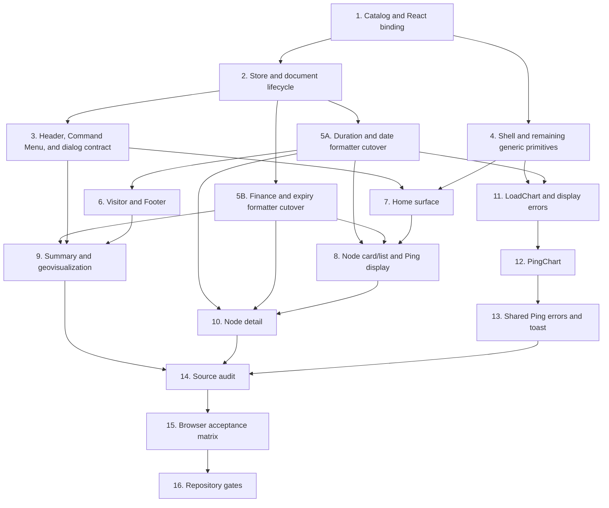

# C4 Internationalization Implementation Plan

## Status and source of truth

**Implemented and verified.** Product and technical behavior are defined in [`tasks/spec.md`](./spec.md). This document records implementation order, file ownership, checkpoints, and verification; the specification remains authoritative.

Application changes were delivered through the clean-cutover sequence below.

## Delivery strategy

Clean cutover. One translation API, one `Lang` type, one store field, no compatibility overloads, no deprecated exports, no duplicated bilingual tables.

Implementation is ordered by contract dependency:



Task 4 is independent after Task 1; Tasks 5A and 5B are independent after Task 2. Task 6 follows 5A. Tasks 7, 8, 9, and 10 become mergeable vertical slices as their listed dependencies complete. Tasks 11–13 remain sequential because they share error and chart-state contracts. Every task ends type-correct; no task relies on a temporary optional language argument or deferred required-prop migration.

## Phase 1 — Foundation and language controls

### Task 1 — Implement the typed catalog and React binding

**Files (3):**

- Create `src/i18n/messages.ts`
- Create `src/i18n/index.ts`
- Create `src/composables/useI18n.ts`

**Work:**

1. Implement `Lang`, catalogs, `CatalogShape`, `MessageKey`, `MessageArgs`, `Translate`, and public helpers exactly as Spec FR-06.
2. Enter the complete FR-15 catalog in one pass. Later tasks consume keys; they do not establish separate dictionaries.
3. Implement typed function messages and `Intl.PluralRules` selection.
4. Implement language validation, preferred-language resolution, alternate language, and region-language mapping as pure functions.
5. Implement `useI18n()` with stable `t` identity per language.

**Acceptance:**

- `enUS satisfies CatalogShape` with no cast that bypasses key parity.
- Static English values are not constrained to Chinese literal values.
- Dynamic keys require their exact parameter object; static keys accept no arguments.
- `messages.ts` and `i18n/index.ts` import no React, Zustand, RPC, browser global, or component code; `useI18n.ts` is the sole React/Zustand binding.
- Resolver examples in Spec FR-01 are reproducible by pure calls.

**Verify:**

```bash
bun run type-check
```

Then run a one-off Bun import smoke for the FR-01 table, pluralized `range.hours`, and `ping.selected`. Also bundle a temporary standalone browser probe with Bun: render `useI18n`, rerender an unrelated prop and assert the same `t` reference, then change `useAppStore.lang` and assert a new `t` reference and translated output. Remove probe artifacts; do not add a test framework or permanent route/file.

### Task 2 — Wire language into store, hydration, and document state

**Files (3):**

- `src/stores/app.ts`
- `src/components/Provider.tsx`
- `src/app/layout.tsx`

**Work:**

1. Remove the store-local `Lang`; import the canonical type/helpers.
2. Add `setLang`, persisted read, invalid-value handling, and browser preference resolution.
3. Move browser hydration to layout-phase execution in Provider without changing theme/media behavior.
4. Synchronize `document.documentElement.lang` from store state.
5. Preserve static `lang="zh-CN"` and metadata behavior.

**Acceptance:**

- Stored valid choice wins; invalid/missing choice follows Spec FR-01.
- Storage exceptions do not break state updates.
- `setLang` touches only `lang` and best-effort storage.
- No new global listener or `isHydrated` state is introduced unless an observed hydration defect proves it necessary and the spec is amended.
- Existing theme mode hydration and transition behavior remains intact.

**Verify:**

```bash
bun run type-check
```

Browser checkpoint: seed stored/browser languages and assert only `<html lang>` plus absence of hydration console errors. Header target-language output begins in Task 3. Confirm hydration does not write a missing/invalid browser-derived choice to localStorage.

### Task 3 — Add language controls and cut over the dialog close contract

**Files (5):**

- `src/components/Header.tsx`
- `src/components/CommandMenu.tsx`
- `src/views/HomeView.tsx` (dialog close label only; full Home copy remains Task 7)
- `src/components/ui/dialog.tsx`
- `src/utils/regionHelper.ts`

**Work:**

1. Replace all Header and Command Menu in-scope hardcoded copy with catalog keys.
2. Add the Header target-language button to the existing action group.
3. Add stable Command action `toggle-language`; build bilingual keywords from both catalog values plus locale codes.
4. Make section titles render-derived rather than module-level translated state.
5. Implement FR-10's one-time emoji/ISO region index and route display, flag-code, emoji, and search helpers through the canonical resolver; pass current language to Command region display.
6. Use `node.unknownOs` only when the backend OS value is missing or whitespace-only.
7. Add required `DialogContent.closeLabel`, remove primitive-owned Chinese, and migrate both current callers (`CommandMenu` and `HomeView`) in the same task before running type-check.
8. Keep Command item IDs, sections, active index, and keyboard behavior stable.
9. At `max-width: 359px`, compact command, Cloudflare Star, admin/theme/language actions, and loading skeletons to 32px; hide only command keycaps and the `Star` span, preserving the language target text and all accessible names.

**Acceptance:**

- Header shows catalog-backed `EN` in Chinese and `中` in English.
- Both controls switch instantly and persist.
- Command searches for the catalog-backed Chinese/English terms and `zh-CN`/`en-US` without component-owned Han literals.
- Existing node, group, view, theme, search-clear, and admin commands still execute.
- Both current DialogContent callers provide the required close label; the primitive remains store-agnostic.
- No language change navigates or reloads.
- 320px Header has no document overflow in both Cloudflare/GitHub and admin build configurations; every action remains reachable.
- Emoji, uppercase/lowercase/whitespace-padded ISO values produce the same localized region name and canonical flag code; unknown region text remains byte-for-byte unchanged.
- Region search remains bilingual and language-independent for emoji and ISO-backed nodes.

**Verify:**

```bash
bun run type-check
```

Run a pure Bun region smoke for FR-10 inputs. Browser checkpoint at 320px and 1280px: pointer and keyboard activation, Ctrl/Cmd+K, arrows, Enter, Escape, bilingual node/region/language search, plus 320px Cloudflare/GitHub and admin compaction.

## Phase 2 — Shared UI and locale formatting

### Task 4 — Localize shell and remaining generic UI contracts

**Files (4):**

- `src/app/page.tsx`
- `src/components/LoadingCover.tsx`
- `src/components/ui/back-top.tsx`
- `src/components/ui/empty.tsx`

**Work:**

1. Translate loading aria labels and skip link.
2. Require `Empty.description`; remove its default Chinese copy.
3. Confirm every currently compiled `Empty` caller already supplies an explicit description; caller-specific translations remain in their owning surface task.
4. Localize BackTop through `useI18n`.

**Acceptance:**

- `Empty` remains independent of app store/i18n.
- All `Empty` callers provide a description and type-check in this task.
- English accessibility tree has no shell-owned Chinese.

**Verify:**

```bash
bun run type-check
```

Browser accessibility snapshot: loading status, skip link, and BackTop.

### Task 5A — Cut over duration and date formatters with every caller

**Files (5):**

- `src/utils/helper.ts`
- `src/components/NodeCard.tsx`
- `src/components/NodeList.tsx`
- `src/composables/useNodePingDisplay.ts`
- `src/views/InstanceDetail.tsx`

**Work:**

1. Implement explicit-language uptime and the closed `DateTimeStyle` API from Spec FR-08.
2. Remove the unreferenced broad `formatUptime()` export.
3. Migrate every current `formatUptimeWithFormat` and `formatDateTime` caller in this same task; no optional language/style compatibility signature remains.
4. Preserve duration truncation, browser-local time zone, Ping bar time precision, and invalid-input fallback.

**Acceptance:**

- Spec FR-08 uptime examples and all four date styles match.
- TypeScript proves no old formatter call remains.
- The task ends type-correct without an overload or default language.
- `Intl.DateTimeFormat` instances are cached by language/style; no formatter is constructed inside a per-node loop.

**Verify:**

```bash
bun run type-check
```

Run a one-off Bun smoke for FR-08 uptime cases, invalid dates, and all four date styles in both locales.

### Task 5B — Cut over finance and expiry formatters with every caller

**Files (4):**

- `src/utils/financeHelper.ts`
- `src/utils/tagHelper.ts`
- `src/components/NodeGeneralCards.tsx`
- `src/views/InstanceDetail.tsx`

**Work:**

1. Add required `lang` to finance formatting and remove every default language from tag/price/expiry APIs.
2. Replace tagHelper's private bilingual strings with catalog calls.
3. Migrate both current `formatFinanceAmount` callers and the inline exchange-rate formatter in this task; existing NodeCard/NodeList tag callers already pass `lang` and must remain type-correct.
4. Correct English singular/plural day forms.
5. Preserve expiry thresholds, billing ranges, exchange-rate calculations/cache, byte math, and `白嫖中` filtering.

**Acceptance:**

- All exported changed signatures force explicit language with no compatibility overload.
- Finance calculations produce identical numbers before locale formatting.
- Rate and amount Intl formatter instances are cached per locale/options.
- The task ends type-correct with every caller migrated.

**Verify:**

```bash
bun run type-check
```

Run a one-off Bun smoke for compact/standard finance output, six-decimal rates, billing custom-day singular/plural, expired, and long-term output.

### Task 6 — Localize VisitorInfoCard and Footer

**Files (2):**

- `src/components/VisitorInfoCard.tsx`
- `src/components/Footer.tsx`

**Work:**

1. Replace translated Visitor strings in state with Spec FR-09 semantic unions.
2. Store visit time as `Date`; derive formatted time at render.
3. Return nullable external geo fields instead of localized loader fallbacks.
4. Add localized disclosure accessible names.
5. Catalog Footer connector copy while preserving brands, versions, links, and filing data.

**Acceptance:**

- Switching language does not rerun geo fetch or UA detection.
- IP, ISP, location, country code, disclosure state, and visit instant are preserved.
- External geo strings remain unchanged.
- Missing fields and unavailable state change language immediately.

**Verify:**

```bash
bun run type-check
```

Browser checkpoint: expand Visitor card, record network request count and visit instant, switch twice, compare.

## Phase 3 — Home and node summaries

### Task 7 — Localize HomeView

**Files (1):**

- `src/views/HomeView.tsx`

**Work:**

1. Localize RPC error, groups, view options, loading state, empty states, and Ping dialog title.
2. Keep group value `all`, view values `card/list`, selected node UUID, search state, and route behavior stable.
3. Pass required Dialog close label and explicit Empty descriptions under Task 4 contracts.
4. Keep announcement content untouched.

**Acceptance:**

- Switching language preserves group, search, selected Ping node, scroll, and view.
- Operator group and announcement text are unchanged.
- Dialog focus handoff remains intact.

**Verify:**

```bash
bun run type-check
```

Browser: group/search/view/dialog state across language switch.

### Task 8 — Localize node cards, list, and Ping display

**Files (4):**

- `src/components/NodeCard.tsx`
- `src/components/NodeList.tsx`
- `src/components/NodePingListCell.tsx`
- `src/composables/useNodePingDisplay.ts`

**Work:**

1. Replace NodeList labels with `ColumnKey` + `labelKey`; keep sort identity stable.
2. Localize labels, sort accessible names, statuses, detail actions, Ping panels, and fallbacks.
3. Pass lang to uptime, price tag, region, and date formatters; use `node.unknownOs` only when the backend OS field is missing or whitespace-only.
4. Translate Ping tooltips at render without changing history/bar class calculations.
5. Keep node/task/tag/nonempty OS text and data math unchanged.

**Acceptance:**

- Sorting remains on the same column/direction through language switch.
- Card/list switch and node navigation remain unchanged.
- Ping shared RPC count/cache does not change.
- Region alt and uptime follow language.
- Online/offline and Ping failure/disabled/no-data states have localized text.

**Verify:**

```bash
bun run type-check
```

Browser: online and offline nodes, card/list, sorting, Ping bars/tooltips before/after switch.

### Task 9 — Localize summary cards, map, and globe

**Files (3):**

- `src/components/NodeGeneralCards.tsx`
- `src/components/NodeEarthMaps.tsx`
- `src/components/NodeEarthGlobe.tsx`

**Work:**

1. Localize summary and finance disclosure labels/aria.
2. Pass current lang to finance/rate formatters.
3. Give finance summary items stable IDs `total-value`, `monthly-spend`, and `remaining-value`; React keys use IDs, never labels.
4. Keep finance currency and disclosure state stable.
5. Localize map region names/tooltips and generic failure; store map failure as locale-independent state.
6. Localize globe/legend accessible region/status labels without adding lang to the cobe mount effect.

**Acceptance:**

- Language changes do not refetch rates, reload map asset, or reinitialize globe.
- Map country identity remains ISO code; display name follows language.
- Finance numbers reformat without changing numeric value.
- Earth/maps/cards mode and finance disclosure remain open/selected.
- Finance summary subtrees keep the same stable keys through language changes.

**Verify:**

```bash
bun run type-check
```

Browser: earth/maps/cards, finance disclosure, region tooltip, request counts, 320/768/1280 layout.

## Phase 4 — Detail and history charts

### Task 10 — Localize InstanceDetail with structured display values

**Files (1):**

- `src/views/InstanceDetail.tsx`

**Work:**

1. Add stable IDs/semantic flags to info and metric item models.
2. Delete `splitMetricValue`, translated suffix regexes, and label-based OS icon branch.
3. Construct finance/expiry value and unit fields from structured source data.
4. Localize all labels, subtitles, statuses, section titles, empty/back actions, and region alt; use `node.unknownOs` only when the backend OS field is missing or whitespace-only.
5. Pass explicit lang to all migrated helpers.

**Acceptance:**

- No branch parses or compares translated copy.
- Node not-found and real node states are bilingual.
- Switching language does not navigate, refetch, or alter node data/finance currency.
- OS icon still renders on the OS row using semantic identity.

**Verify:**

```bash
bun run type-check
```

Browser: real node, nonexistent node, all detail sections, both languages.

### Task 11 — Add error origins, range policy, and refactor LoadChart

**Files (6):**

- Create `src/utils/displayError.ts`
- Create `src/utils/chartRange.ts`
- `src/utils/api.ts`
- `src/utils/rpc.ts`
- `src/utils/init.ts` (RpcError constructor cutover only; toast copy remains Task 13)
- `src/components/LoadChart.tsx`

**Work:**

1. Add required FR-11 origin options to `ApiError` and `RpcError`; classify every constructor at its response/transport/client boundary, remove synthesized `Unknown error` from remote paths, and migrate every current constructor call in these files.
2. Implement cycle-free `getDisplayErrorMessage` using a structural origin check; only a nonempty `origin === 'remote'` Error message is verbatim.
3. Implement the pure shared FR-07 preservation-limit/candidate/selection policy; LoadChart renders and fetches from the synchronously normalized semantic selection, while a guarded render-phase update reconciles stale raw state before commit.
4. Replace translated range state with `number | null` and stable tab values.
5. Replace localized `seriesName` branches with stable ECharts `seriesId`.
6. Translate range labels, locale date/time, cards, axes, legends, tooltip labels, empty/error states.
7. Store raw error object and render localized fallback.
8. Keep record fetch/poll effects independent of lang/t.

**Acceptance:**

- Every `new ApiError`/`new RpcError` call has an explicit correct origin; remote REST constructors preserve empty messages; wire API/RPC methods and payloads are unchanged.
- Only decoded nonempty remote response messages render verbatim; HTTP/network/WebSocket/timeout/client/empty details use localized fallback.
- Invalid Load/Ping preservation limits use specified fallbacks; a removed Load selection normalizes to realtime and changes the effective fetch dependency exactly once.
- Same selected range and record array survive language switch.
- Realtime poll timer is not restarted by language.
- Chart labels/tooltips update immediately.
- Download/upload and load branches use `seriesId` only.

**Verify:**

```bash
bun run type-check
```

Run a one-off Bun smoke covering remote, transport, client, empty-remote, and unknown error display. In the same smoke, cover absent/zero/negative/NaN/infinite/sub-hour preservation limits and model a `24 → removed → fallback` selection: a fake fetch counter increments once when the effective range changes and zero times when raw state reconciles before commit. Browser-check live, 4h, 24h/longest available, language switching, request/timer behavior, and tooltips.

### Task 12 — Refactor and localize PingChart

**Files (1):**

- `src/components/PingChart.tsx`

**Work:**

1. Replace translated range state with numeric hours and stable tab values, consuming Task 11's shared sanitized range policy.
2. Render/fetch from the synchronously normalized effective hours and reconcile stale raw state with a guarded render-phase update, without a second fetch.
3. Use task ID as ECharts series ID and tooltip lookup identity.
4. Translate ranges, empty/error, selection controls/count, display toggles, axis and aria.
5. Keep task names external and HTML escaped.
6. Store raw errors and use Task 11 display-error helper.
7. Keep fetch effects independent of lang/t.

**Acceptance:**

- Hours, selected task IDs, all/none/custom state, delay/loss/peak toggles, records, and fallback mode survive language switch.
- Invalid limits and a removed selection normalize to the first valid Ping range; the effective fetch dependency changes exactly once.
- Duplicate task names do not determine tooltip identity.
- No additional `public:queryMetrics`, `public:getPingMetricStats`, or legacy request occurs on switch.

**Verify:**

```bash
bun run type-check
```

Browser: partial selection, three display toggles, at least two ranges, language switch, tooltip, request count. Audit that the fetch effect depends on effective numeric hours, not raw stale state or translated labels.

### Task 13 — Localize shared Ping failures and WebSocket toast

**Files (2):**

- `src/composables/useNodePingStats.ts`
- `src/utils/init.ts`

**Work:**

1. Store raw `unknown`/Error in shared Ping entry; remove translated fallback from cache.
2. Keep cache version, key, refresh interval, subscribers, request scope, and stats derivation unchanged.
3. Return raw error state for display derivation.
4. Translate WebSocket fallback toast from current store language at event time.
5. Do not revive the commented reconnect toast.

**Acceptance:**

- Language switching neither invalidates nor reloads shared Ping records.
- Existing error display changes language because fallback is render-derived.
- Toast reflects language active when fallback occurs.

**Verify:**

```bash
bun run type-check
```

Browser/request observation for shared Ping; actual toast path only if reproducible without altering production logic.

## Phase 5 — Verification gates

### Task 14 — Audit source against localization and identity contracts

**Files:** Read-only unless a concrete defect is found. Any correction MUST name its exact file and remain within the approved spec; do not perform broad cleanup.

**Work:**

1. Run the Han-literal classification in Spec 10.2.
2. Search for translated strings in state, equality, keys, effect dependencies, and ECharts branches.
3. Search all callers of changed exported symbols.
4. Confirm manifest, package, lockfile, route, API/RPC wire methods/payloads, and packaging contracts are unchanged; internal error-origin edits in `api.ts`/`rpc.ts` are expected.

**Acceptance:**

- Every search result is classified with evidence.
- No in-scope visitor copy or translated identity defect remains.
- If a defect requires a new behavior/file outside the spec, update spec and plan before code.

**Verify:** source-search output and changed-symbol caller inventory.

### Task 15 — Execute the real-browser acceptance matrix

Follow Spec Section 10.3 exactly.

**Acceptance:** all reproducible scenarios pass at 320×800, 768×900, and 1280×900 in both languages; the 320px Header passes separately in Cloudflare/GitHub and admin configurations; unavailable failure paths are explicitly reported, never inferred as exercised.

**Verify:** browser observations, accessibility snapshots, console state, document width, localStorage, `<html lang>`, and request counts.

### Task 16 — Run final repository gates

Run once after browser acceptance:

```bash
bun run lint
bun run build
```

**Acceptance:**

- Lint zero warnings.
- Type check and Next export succeed.
- Theme archive succeeds with unchanged contract.
- No dependency/lockfile/manifest change.

## Checkpoint policy

- After Task 3: language lifecycle and controls are usable.
- After Task 6: shared format/state contracts are stable.
- After Task 9: Home is bilingual end-to-end.
- After Task 13: detail and data/history paths are bilingual end-to-end.
- Tasks 14–16 are mandatory release gates, not optional polish.

At a checkpoint, fix contract regressions before proceeding. Do not carry a type failure, untranslated required primitive prop, or network-on-language-change defect into the next phase.

## Risk controls

| Risk                                 | Control                                                                                   |
| ------------------------------------ | ----------------------------------------------------------------------------------------- |
| Catalog key drift                    | `enUS satisfies CatalogShape`; full catalog created before caller migration.              |
| Hydration flash/mismatch             | Static zh fallback plus Provider layout-phase resolution; real console/paint observation. |
| Display text controls behavior       | Explicit FR-07 migrations and identity audit.                                             |
| Visitor/finance stale-language state | Store semantic/raw state, derive text at render.                                          |
| Extra network calls                  | Separate fetch effects from formatting memos; request-count acceptance scenarios.         |
| English mobile overflow              | Target-language 32px control and 320px document-width/action reachability checks.         |
| Unsafe raw errors/tooltips           | Central error classifier; escape external tooltip data; plain-text catalog.               |
| Partial caller migration             | Type-check after every exported signature change plus final caller search.                |
| Accidental admin/package scope       | Explicit unchanged-file audit and final build package check.                              |
